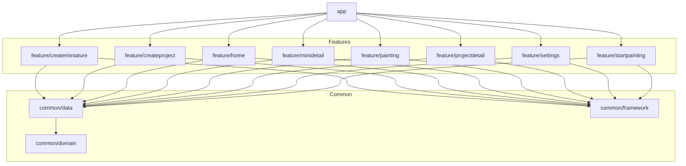

# GreyHunter

> Track your miniatures.
> 
> **Kill the grey shame.**
> 
> Finish what you started.

  
  
  
  
  
  

# The problem (grey shame)

We all have it.

A shelf full of unpainted miniatures.
A growing pile of shame.
Projects that never reach 100%.

Grey Hunter helps you track your painting progress and finally finish what you started.

# What is Grey Hunter?

Grey Hunter is an Android app designed to help miniature painters:

- Organize painting projects
- Track individual miniatures
- Visualize progress clearly
- Stay motivated
- Import and export your data safely

No more forgotten units. No more eternal grey armies.

# Features & Demo

<table>
  <tr>
    <td width="60%" valign="top">
      <h3>Home – Overview at a Glance</h3>
      
Get an instant overview of all your projects and track their progress visually.

      
Quickly access any project or miniature with a single tap and stay focused on what matters most.

      <h4>Main Features</h4>
      <ul>
        <li><strong>Visual progress tracking</strong> for all projects</li>
        <li>Quick navigation to project details</li>
        <li>Clean and intuitive dashboard layout</li>
      </ul>
      
Stay organized, stay motivated, and always know what’s next.

    </td>
    <td width="40%" valign="top">
      
    </td>
  </tr>
</table>

<table>
  <tr>
    <td width="60%" valign="top">
      <h3>Paint Mode</h3>
      
Select your miniatures and enter a distraction-free <strong>Zen Mode</strong> to fully focus on painting.

      
After each session, you can easily update the miniature’s status and keep your progress accurate and up to date.

      <h4>Key Highlights</h4>
      <ul>
        <li><strong>Select</strong> one or multiple miniatures</li>
        <li>Distraction-free painting session</li>
        <li>Quick status updates after finishing</li>
      </ul>
      
Perfect for hobbyists who want structure without losing their creative flow.

    </td>
    <td width="40%" valign="top">
      
    </td>
  </tr>
</table>

<table>
  <tr>
    <td width="60%" valign="top">
      <h3>Settings & Customization</h3>
      
Make the app truly yours with flexible customization options.

      <h4>Available Options</h4>
      <ul>
        <li><strong>Dark / Light Mode</strong></li>
        <li>Customizable progress bar colors</li>
        <li>Export all data to <strong>CSV</strong></li>
      </ul>
      
Simple, clean, and fully under your control.

    </td>
    <td width="40%" valign="top">
      
    </td>
  </tr>
</table>

# App download

Download the app from the playstore following this [link](https://play.google.com/store/apps/details?id=com.devalr.greyhunter).

# Tech Stack

- 100% Kotlin
- 100% Jetpack Compose
- Koin
- Navigation 3 API
- Clean architecture
- Modular architecture
- Room
- Datastore

# Architecture

This project is built in **Kotlin** and uses **Koin** as an injection framework, building its views
with **Jetpack Compose**.

The application follows a clean, modular architecture with clearly separated responsibilities across modules:

## Core Modules

| Module | Responsibility | Depends On |
|--------|---------------|------------|
| `app` | Entry point, navigation setup, DI configuration | feature modules |
| `common/domain` | Business logic, domain models, repository contracts | — |
| `common/data` | Repository implementations, Room, DataStore, mappers | common/domain |
| `common/framework` | Shared composables, UI utilities, design system | — |

## Feature Modules

Each feature module depends only on the common modules.

| Module | Responsibility |
|--------|---------------|
| `feature/home` | Home screen UI and ViewModel |
| `feature/createproject` | Project creation flow |
| `feature/createminiature` | Miniature creation flow |
| `feature/projectdetail` | Project details screen |
| `feature/minidetail` | Miniature details screen |
| `feature/startpainting` | Miniature selection before painting |
| `feature/painting` | Painting session workflow |
| `feature/settings` | App settings and customization |

## Visual representation

