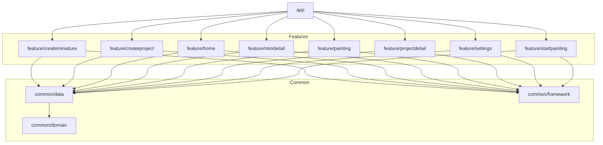

# GreyHunter

> Track your miniatures.
> 
> **Kill the grey shame.**
> 
> Finish what you started.

  
  
  
  
  
  

# The problem (grey shame)

We all have it.

A shelf full of unpainted miniatures.
A growing pile of shame.
Projects that never reach 100%.

Grey Hunter helps you track your painting progress and finally finish what you started.

# What is Grey Hunter?

Grey Hunter is an Android app designed to help miniature painters:

- Organize painting projects
- Track individual miniatures
- Visualize progress clearly
- Stay motivated
- Import and export your data safely

No more forgotten units. No more eternal grey armies.

# Features

### 📁 Create and manage projects with its miniatures
Create the number of project that you need and add them your miniatures. You can add images of the whole project or to each miniature to keep your motivation.
### 📊 Visual progress
Keep the track of your projects at a glance with visual progress bars that resume the status.
### 🖌️ Paint mode
Focus mode to enhance the painting activity. Select the miniatures to be paint and just paint. After it, update the progress of each of the painted miniatures.
### 💾 Import / Export
Save your data into a .csv file and restore it afterwards. This is useful if you change your phone or if you need to share your data.
### ⚙️ Customisation
Switch between light and dark mode or change the color of the progress bars.

# Demo

<table>
  <tr>
    <td width="60%">

Get an instant overview of all your projects.  
Track progress visually and jump into any project or miniature with a single tap.

Stay focused, stay organized, and always know what’s next.

    </td>
    <td width="40%">
      
    </td>
  </tr>
</table>

<table>
  <tr>
    <td width="60%">

Select your miniatures and enter a distraction-free **Zen Mode** to fully focus on painting.

After each session, you can easily update the miniature’s status and keep your progress accurate and up to date.

Perfect for hobbyists who want structure without losing their creative flow.

    </td>
    <td width="40%">
      
    </td>
  </tr>
</table>

<table>
  <tr>
    <td width="60%">

Make the app truly yours with flexible customization options.

Easily adapt the experience to your preferences and manage your data safely.

Simple, clean, and fully under your control.

    </td>
    <td width="40%">
      
    </td>
  </tr>
</table>

### Home and main features

Watch at a glance the progress of your projects or click to see the details of any project or miniature.

### Paint mode 

Select miniatures and start a zen mode to paint the selected miniatures. After the painting session the status of the miniature can be updated.

  

### Settings and customisation 

The dark/light mode can be changed, as well as the color of the progress bars. Also the data stored in the app can be exported into a CSV.

# App download

Download the app from the playstore following this [link](https://play.google.com/store/apps/details?id=com.devalr.greyhunter).

# Tech Stack

- 100% Kotlin
- 100% Jetpack Compose
- Koin
- Navigation 3 API
- Clean architecture
- Modular architecture
- Room
- Datastore

# Architecture

This project is built in **Kotlin** and uses **Koin** as an injection framework, building its views
with **Jetpack Compose**.

The application follows a clean, modular architecture with clearly separated responsibilities across modules:

### app
Entry point of the application.

Contains the single `MainActivity`, navigation setup, and dependency injection configuration.

Depends on `feature modules`.

### common/domain
Contains the core business logic of the application:
- Domain models
- Repository interfaces

### common/data
Implements the domain layer contracts:
- Repository implementations
- Room database
- DataStore
- Mappers

The project doesn't rely on external API's.

Depends on: `common/domain`.

### common/framework
Shared UI components and utilities used across feature modules:
-Reusable composables
-UI helpers

Design system elements (if applicable)### feature/createminiature
UI and ViewModel responsible for the miniature creation flow.

### feature/createminiature
UI and ViewModel responsible for the miniature creation flow.

Depends on `common modules`.

### feature/createproject
UI and ViewModel responsible for the project creation flow.

Depends on `common modules`.

### feature/home
UI and ViewModel for the home screen.

Depends on `common modules`.

### feature/minidetail
UI and ViewModel responsible for displaying miniature details.

Depends on `common modules`.

### feature/painting
UI and ViewModel related to the miniature painting workflow.

Depends on `common modules`.

### feature/projectdetail
UI and ViewModel responsible for displaying project details.

Depends on `common modules`.

### feature/settings
UI and ViewModel for application settings and customization options.

Depends on `common modules`.

### feature/startpainting 
UI and ViewModel responsible for selecting miniatures to begin a painting session.

Depends on `common modules`.

